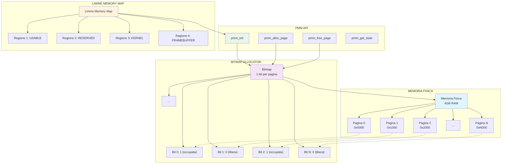

```mermaid
graph TB
subgraph "MEMORIA FISICA"
PM[Memoria Fisica<br/>4GB RAM]
PM --> P0[Pagina 0<br/>0x0000]
PM --> P1[Pagina 1<br/>0x1000]
PM --> P2[Pagina 2<br/>0x2000]
PM --> DOTS1[...]
PM --> PN[Pagina N<br/>0xN000]
end

    subgraph "BITMAP ALLOCATOR"
        BM[Bitmap<br/>1 bit per pagina]
        BM --> B0["Bit 0: 1 (occupata)"]
        BM --> B1["Bit 1: 0 (libera)"]
        BM --> B2["Bit 2: 1 (occupata)"]
        BM --> DOTS2[...]
        BM --> BN["Bit N: 0 (libera)"]
    end

    subgraph "PMM API"
        INIT[pmm_init]
        ALLOC[pmm_alloc_page]
        FREE[pmm_free_page]
        STATS[pmm_get_stats]
    end

    subgraph "LIMINE MEMORY MAP"
        LMM[Limine Memory Map]
        LMM --> R1[Regione 1: USABLE]
        LMM --> R2[Regione 2: RESERVED]
        LMM --> R3[Regione 3: KERNEL]
        LMM --> R4[Regione 4: FRAMEBUFFER]
    end

    LMM --> INIT
    INIT --> BM
    P0 -.-> B0
    P1 -.-> B1
    P2 -.-> B2
    PN -.-> BN

    ALLOC --> BM
    FREE --> BM
    BM --> PM

    style PM fill:#e1f5fe
    style BM fill:#f3e5f5
    style INIT fill:#e8f5e8
    style LMM fill:#fff3e0
```
